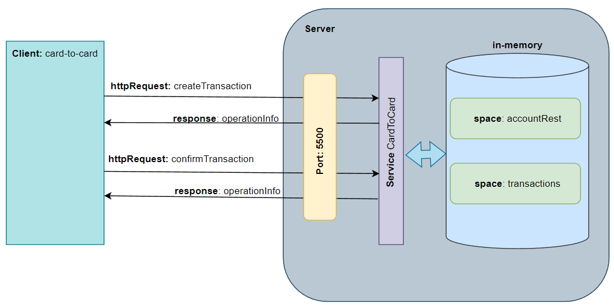

# КУРСОВОЙ ПРОЕКТ: «Сервис перевода денег»

## 1. Описание 
Серверная бэковая часть располагается на порту 5500. Сервис обеспечивает обработку двух типов запросов:
создание транзакций, подтверждение или откат ранее созданной транзакции.
Перед созданием транзакции происходит валидация параметров запроса на уровне контроллера, посредством встроенных и пользовательских аннотаций
. Далее в сервисном слое выполняется ряд проверок, таких как:
* проверка наличия счетов карты дебет , карты Кредит в пространстве accountRest
* проверка перспективного баланса по карте дебета с учетом не подтвержденных проводок и текущего перевода в пространстве transactions,
если балан будет отрицательным, то в тако случе выбрасываться исключечение и транзакция не создается.

Перед подтверждением\откатом транзакции в сервисном слое проверяется наличие подтверждаемой транзакции в пространстве transaction, если транзакция не найдена,
выбрасывается исключением.
* Также перед подтверждением транзации проверяется ее состояние на тип уже подтвержденной или уже откаченой  в пространестве transaction transactions
* Перед подтверждением повторно проводится проверка на состояние перспективного баланса, если баланс оказывается отрицательным,
то подтверждаема транзакция откатывается и выбрасывается исключение, иначе отранзакция подтверждается, денежные средства списываются с карте дебета,
и зачисляется на карту по кредиту, выполняется проверка на присутствие рассчитанной комиссии и если комиссия найдена  также списывает на с карты по дебету 
на счет комиссий. 



### Команда запуска
```
docker-compose up -d
```

### 1. Create transaction
#### Пример json-запроса для создания транзакции
url: http://localhost:5500/transfer
```
{
"cardFromNumber":"4548987854653322",
"cardFromValidTill":"08/25",
"cardFromCVV":"581",
"cardToNumber":"4548987854653311",
"amount":{
            "value":500,
            "currency":"RUR"
          }
}
```
#### Пример json-ответа на успешно созданную транзакцию
```
{
    "operationId": "4745f8b8-9a35-41a2-a865-949fd2e52ee2"
}
```
### 2. Confirm transaction
url: http://localhost:5500/confirmOperation
#### Пример json-запроса дя подтверждения\отката ранее созданной транзакции
```
{
"operationId": "468f149c-1782-4a9e-90df-5d4fb2aef91f",
"code":"0000"
}
```
0000 - определено как COMMIT
0001 - определено как ROLLBACK
#### Пример json-ответа после подтверждения\отката транзакции
```
{
    "operationId": "4745f8b8-9a35-41a2-a865-949fd2e52ee2"
}
```
